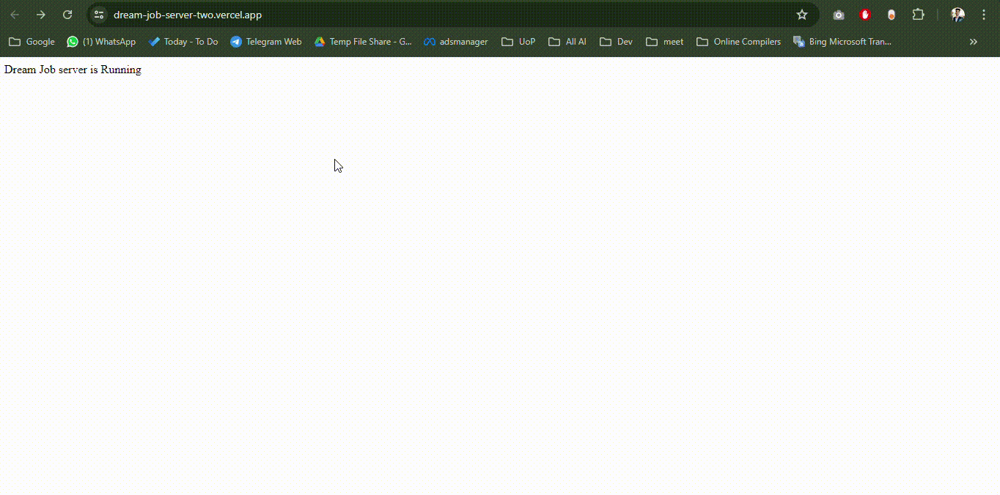

<h1 align="center">Dream Job Server </h1>

  

 

Live Server: [Dream-Job-Server](https://dream-job-server-two.vercel.app/)

Client Repo Link: [Dream-Job-Client-Repo](https://github.com/younusFoysal/Dream-Job-Client)

## Project Overview
- Dream Job Server is designed to streamline the job application process by providing a robust backend server for job-related functionalities.
- It helps users manage job listings, applications, and recruitment processes efficiently, reducing the complexities of job hunting and hiring.

## Features

- CRUD operations for job listings
- Search and filter jobs by various criteria
- Secure user login and registration
- Role-based access control
- Track application status
- Manage candidate information

## Technologies Used
- Node.js
- Express.js
- MongoDB
- JSON Web Tokens (JWT)
- CORS
- Dotenv
- Nodemon

## How to Run Locally
1. Clone the repository: `git clone https://github.com/younusFoysal/Dream-Job-Server.git`
2. Navigate to the project directory: `cd Dream-Job-Server`
3. Install dependencies: `npm install`
4. Set up environment variables as per `.env`.
5. Start the server: `nodemon index.js`

---

